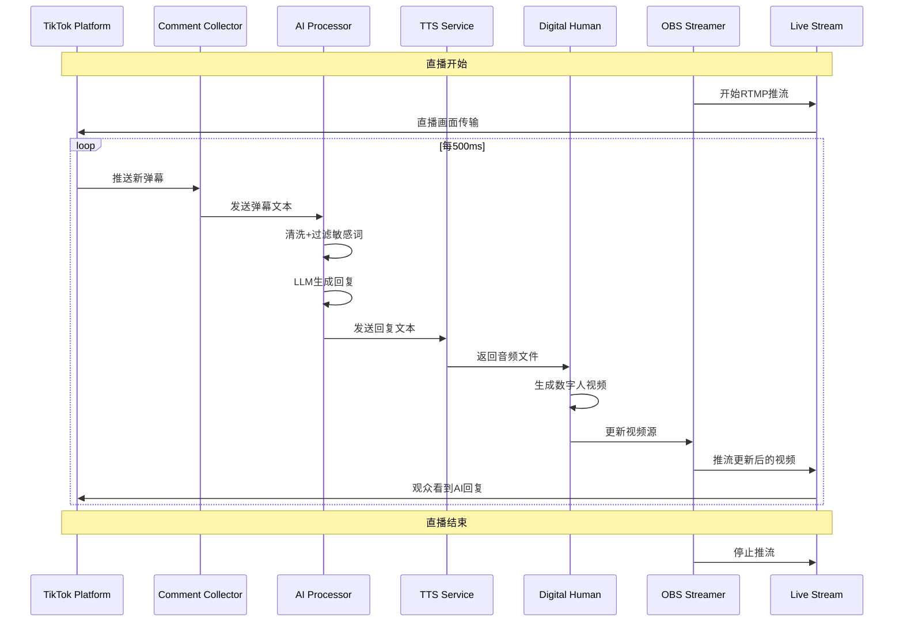

# AI数字人直播系统架构流程图

## 一、整体系统架构图

```
┌─────────────────────────────────────────────────────────────────────────────┐
│                        AI数字人直播系统架构总览                              │
├─────────────────────────────────────────────────────────────────────────────┤
│                                                                             │
│  ┌─────────────┐    ┌─────────────┐    ┌─────────────┐    ┌─────────────┐  │
│  │  数据采集层   │    │  AI处理层    │    │  媒体生成层   │    │  推流输出层   │  │
│  │  Data Layer  │    │  AI Layer    │    │ Media Layer  │    │ Stream Layer │  │
│  └──────┬──────┘    └──────┬──────┘    └──────┬──────┘    └──────┬──────┘  │
│         │                  │                  │                  │         │
│  ┌──────▼──────┐    ┌──────▼──────┐    ┌──────▼──────┐    ┌──────▼──────┐  │
│  │ 弹幕监听模块 │    │  AI问答引擎  │    │  TTS语音合成 │    │  数字人驱动  │  │
│  │ Danmaku     │    │  LLM Engine  │    │  TTS Service │    │ Digital    │  │
│  │ Listener    │────▶│             │────▶│             │────▶│ Human      │  │
│  └─────────────┘    └─────────────┘    └─────────────┘    └─────────────┘  │
│         │                  │                  │                  │         │
│  ┌──────▼──────┐    ┌──────▼──────┐    ┌──────▼──────┐    ┌──────▼──────┐  │
│  │ 礼物监听模块 │    │ 商品知识库   │    │ 音频后处理  │    │ 视频渲染引擎 │  │
│  │ Gift        │    │ Product DB  │    │ Audio Post- │    │ Video       │  │
│  │ Listener    │    │             │    │ Processing  │    │ Renderer    │  │
│  └─────────────┘    └─────────────┘    └─────────────┘    └─────────────┘  │
│                                                                             │
│  ┌─────────────────────────────────────────────────────────────────────┐    │
│  │                          控制与监控层                                 │    │
│  │                       Control & Monitoring Layer                     │    │
│  └─────────────────────────────────────────────────────────────────────┘    │
│         │                  │                  │                  │         │
│  ┌──────▼──────┐    ┌──────▼──────┐    ┌──────▼──────┐    ┌──────▼──────┐  │
│  │  系统监控    │    │  日志系统    │    │  错误处理    │    │  配置管理    │  │
│  │  System     │    │  Logging    │    │  Error      │    │  Config     │  │
│  │  Monitor    │    │  System     │    │  Handler    │    │  Manager    │  │
│  └─────────────┘    └─────────────┘    └─────────────┘    └─────────────┘  │
│                                                                             │
└─────────────────────────────────────────────────────────────────────────────┘
```

## 二、TikTok海外版架构流程图

### 2.1 数据流图
```
┌─────────────────┐    ┌─────────────────┐    ┌─────────────────┐
│   TikTok直播平台  │    │   弹幕采集系统    │    │   数据清洗模块    │
│   Live Platform  │    │  Danmaku Collector│    │  Data Cleaner   │
└────────┬────────┘    └────────┬────────┘    └────────┬────────┘
         │                      │                      │
         │  RTMP Stream         │  WebSocket/API       │
         │  (Video Output)      │  (Comments Input)    │
         ▼                      ▼                      ▼
┌─────────────────┐    ┌─────────────────┐    ┌─────────────────┐
│   OBS推流客户端   │    │   TikHub API     │    │   敏感词过滤     │
│   OBS Client     │◀───┤   /第三方库       │◀───┤  Sensitive Word │
└────────┬────────┘    └────────┬────────┘    └────────┬────────┘
         │                      │                      │
         │  Video Feed          │  Cleaned Comments    │
         ▼                      ▼                      ▼
┌─────────────────────────────────────────────────────────────┐
│                    AI处理核心引擎                             │
│                    AI Processing Core                        │
├─────────────────────────────────────────────────────────────┤
│  ┌─────────────┐    ┌─────────────┐    ┌─────────────┐      │
│  │  OpenAI GPT  │    │  Prompt工程   │    │  商品知识库   │      │
│  │   GPT-4o-mini │◀──┤  Prompt Eng. │◀──┤  Product DB  │      │
│  └──────┬──────┘    └──────┬──────┘    └──────┬──────┘      │
│         │                  │                  │             │
│  ┌──────▼──────┐    ┌──────▼──────┐    ┌──────▼──────┐      │
│  │  回复生成     │    │  多语言支持   │    │  合规检查     │      │
│  │  Response    │    │  Multi-     │    │  Compliance │      │
│  │  Generator   │    │  lingual    │    │  Check      │      │
│  └──────┬──────┘    └─────────────┘    └──────┬──────┘      │
│         │                                     │             │
└─────────┼─────────────────────────────────────┼─────────────┘
          │                                     │
          ▼                                     ▼
┌─────────────────┐                    ┌─────────────────┐
│  ElevenLabs TTS  │                    │   日志记录系统    │
│  Text-to-Speech  │                    │  Logging System  │
└────────┬────────┘                    └─────────────────┘
         │
         │  Audio File (.mp3)
         ▼
┌─────────────────┐    ┌─────────────────┐    ┌─────────────────┐
│   D-ID数字人API   │    │   视频合成引擎    │    │   输出视频文件    │
│   Digital Human  │───▶│  Video Compositor│───▶│  Output Video   │
│   API (D-ID)     │    │                 │    │  File (.mp4)    │
└─────────────────┘    └────────┬────────┘    └────────┬────────┘
                                │                      │
                                │  Video Data          │  File System
                                ▼                      ▼
                        ┌─────────────────┐    ┌─────────────────┐
                        │   OBS媒体源更新   │    │   本地存储备份    │
                        │  OBS Source Update│    │  Local Storage  │
                        └─────────────────┘    └─────────────────┘
```

### 2.2 时序图


### 2.3 组件交互图
```
┌──────────────┐      HTTP/WebSocket      ┌──────────────┐
│  TikTok API   │◄─────────────────────────│ 弹幕采集服务   │
│   (External)  │                          │ Comment Service│
└──────────────┘                          └──────┬───────┘
                                                 │ JSON
                                                 ▼
                                        ┌──────────────┐
                                        │  消息队列     │
                                        │ Message Queue│
                                        │  (Redis/RabbitMQ)│
                                        └──────┬───────┘
                                               │
                                               ▼
┌──────────────┐      REST API        ┌──────────────┐
│  OpenAI API   │◄─────────────────────│  AI处理服务   │
│   (External)  │                      │ AI Processor │
└──────────────┘                      └──────┬───────┘
                                             │
                                             ▼
                                    ┌──────────────┐
                                    │  回复缓存     │
                                    │ Response Cache│
                                    └──────┬───────┘
                                           │
                                           ▼
┌──────────────┐      REST API        ┌──────────────┐
│ ElevenLabs API│◄─────────────────────│  TTS服务     │
│   (External)  │                      │ TTS Service  │
└──────────────┘                      └──────┬───────┘
                                             │ Audio
                                             ▼
                                    ┌──────────────┐
                                    │  音频处理     │
                                    │ Audio Processor│
                                    └──────┬───────┘
                                           │
                                           ▼
┌──────────────┐      REST API        ┌──────────────┐
│   D-ID API    │◄─────────────────────│ 数字人服务    │
│   (External)  │                      │ Digital Human│
└──────────────┘                      └──────┬───────┘
                                             │ Video
                                             ▼
                                    ┌──────────────┐
                                    │  视频处理     │
                                    │ Video Processor│
                                    └──────┬───────┘
                                           │
                                           ▼
                                    ┌──────────────┐
                                    │  OBS控制      │
                                    │ OBS Controller│
                                    └──────┬───────┘
                                           │
                                           ▼
                                    ┌──────────────┐
                                    │  TikTok直播   │
                                    │ Live Stream   │
                                    └──────────────┘
```

## 三、抖音国内版架构流程图

### 3.1 数据流图（强合规版本）
```
┌─────────────────┐    ┌─────────────────┐    ┌─────────────────┐
│   抖音开放平台     │    │   官方直播接口     │    │   合规审核系统    │
│   Douyin Open    │    │  Official Live  │    │  Compliance     │
│   Platform       │    │  API            │    │  Review System  │
└────────┬────────┘    └────────┬────────┘    └────────┬────────┘
         │                      │                      │
         │  OAuth 2.0           │  Webhook Callback    │  Pre-approval
         │  Authentication      │  (Comments/Gifts)    │  Check
         ▼                      ▼                      ▼
┌─────────────────┐    ┌─────────────────┐    ┌─────────────────┐
│   访问令牌管理     │    │   数据解析模块     │    │   内容安全过滤    │
│   Token Manager  │◀───┤  Data Parser    │◀───┤  Content Safety │
└────────┬────────┘    └────────┬────────┘    └────────┬────────┘
         │                      │                      │
         │  Valid Token         │  Structured Data     │  Approved Content
         ▼                      ▼                      ▼
┌─────────────────────────────────────────────────────────────┐
│                   国产AI处理引擎                              │
│                   Domestic AI Engine                         │
├─────────────────────────────────────────────────────────────┤
│  ┌─────────────┐    ┌─────────────┐    ┌─────────────┐      │
│  │ 火山方舟/通义  │    │  AI身份声明    │    │  商品白名单    │      │
│  │ VolcEngine/  │◀──┤  AI Identity │◀──┤  Product    │      │
│  │  Tongyi      │    │  Declaration │    │  Whitelist  │      │
│  └──────┬──────┘    └──────┬──────┘    └──────┬──────┘      │
│         │                  │                  │             │
│  ┌──────▼──────┐    ┌──────▼──────┐    ┌──────▼──────┐      │
│  │  强合规生成    │    │  风险词过滤    │    │  广告标识添加    │      │
│  │  Strict      │    │  Risk Word  │    │  Ad Label   │      │
│  │  Compliance  │    │  Filter     │    │  Addition   │      │
│  └──────┬──────┘    └─────────────┘    └──────┬──────┘      │
│         │                                     │             │
└─────────┼─────────────────────────────────────┼─────────────┘
          │                                     │
          ▼                                     ▼
┌─────────────────┐                    ┌─────────────────┐
│  阿里云/讯飞TTS   │                    │   审计日志系统    │
│  Aliyun/Xunfei  │                    │  Audit Log      │
│  TTS            │                    │  System         │
└────────┬────────┘                    └─────────────────┘
         │
         │  Audio File (.mp3)
         ▼
┌─────────────────┐    ┌─────────────────┐    ┌─────────────────┐
│  硅基智能数字人    │    │   本地渲染引擎    │    │   视频合规检查    │
│  Guiji Digital  │───▶│  Local Render   │───▶│  Video Compliance│
│  Human          │    │  Engine         │    │  Check          │
└─────────────────┘    └────────┬────────┘    └────────┬────────┘
                                │                      │
                                │  Rendered Video      │  Approved Video
                                ▼                      ▼
                        ┌─────────────────┐    ┌─────────────────┐
                        │  直播伴侣控制     │    │   本地文件存储    │
                        │  Live Companion  │    │  Local File     │
                        │  Controller      │    │  Storage        │
                        └─────────────────┘    └─────────────────┘
```

### 3.2 合规检查流程图
```
开始处理弹幕
    │
    ▼
┌──────────────┐
│ 接收弹幕消息   │
│ Receive Comment│
└──────┬───────┘
       │
       ▼
┌──────────────┐
│ 初步格式验证   │
│ Format Validation│
└──────┬───────┘
       │
       ▼
┌──────────────┐
│ 敏感词过滤     │
│ Sensitive Word │
│   Filter      │
└──────┬───────┘
       │
       ▼
┌──────────────┐
│ 广告内容检测   │
│ Ad Content    │
│  Detection    │
└──────┬───────┘
       │
       ▼
┌──────────────┐
│ 政治风险检测   │
│ Political Risk│
│  Detection    │
└──────┬───────┘
       │
       ▼
┌──────────────┐
│ 虚假宣传检测   │
│ False Claim  │
│  Detection    │
└──────┬───────┘
       │
       ▼
┌──────────────┐
│ 通过所有检查？  │
│ Pass All Checks?│
└──────┬───────┘
       │
    ┌──┴──┐
    │     │
    ▼     ▼
通过   不通过
    │     │
    ▼     ▼
┌──────────────┐   ┌──────────────┐
│ 进入AI处理流程  │   │ 记录违规日志   │
│ AI Processing │   │ Log Violation│
└──────────────┘   └──────────────┘
```

### 3.3 抖音官方接口调用流程
```
┌──────────────┐          OAuth 2.0          ┌──────────────┐
│   客户端应用     │──────────────────────────